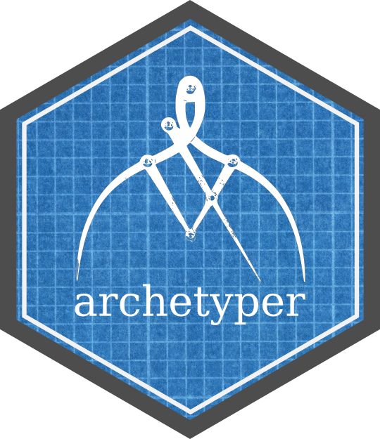

<a href='https://github.com/mkorvink/archetyper/'></a>

  <!-- badges: start -->
  [](https://github.com/mkorvink/archetyper/actions)
  [](https://codecov.io/gh/mkorvink/archetyper?branch=main)
  [](https://www.tidyverse.org/lifecycle/#maturing)
   <!-- badges: end -->

## Overview

archetyper is a package that initializes data science and data mining projects by generating common workflow components and surrounding files to support technical best practices:

  - generate() creates a new project with templated files and directories to support a data mining workflow.

### Development version

To get a bug fix or use a feature from the development version, you
can install the development version of archetyper from GitHub.

``` r
#install.packages("devtools")
#> devtools::install_github("mkorvink/archetyper")
```

## Usage

A new project can be instantiated using the generate() function.

``` r
#> library(archetyper)

#> archetyper::generate("majestic_12")

#> list.files("majestic_12/")
[1] "data_input"        "data_output"       "data_working"      "docs"             
[5] "majestic_12.Rproj" "models"            "R"                 "readme.md"
[9] ".gitignore"

#> list.files("majestic_12/R")
 [1] "0_test.R"      "1_integrate.R" "2_enrich.R"    "3_model.R"     "4_evaluate.R" 
 [6] "5_present.Rmd" "api.R"         "common.R"      "explore.R"     "lint.R"       
[11] "mediator.R"    "utilities.R"
```
A runnable demo project will be created with the generate_demo(). 

``` r
#> archetyper::generate_demo()
```
You can learn more about archetyper in `vignette("archetyper")`.

Acknowledgments
---------------

This readme was modeled after the dplyr readme.

## Code of conduct

Please note that this project is released with a [Contributor Code of
Conduct](https://pkgdown.r-lib.org/CODE_OF_CONDUCT.html). By
participating in this project you agree to abide by its terms.
